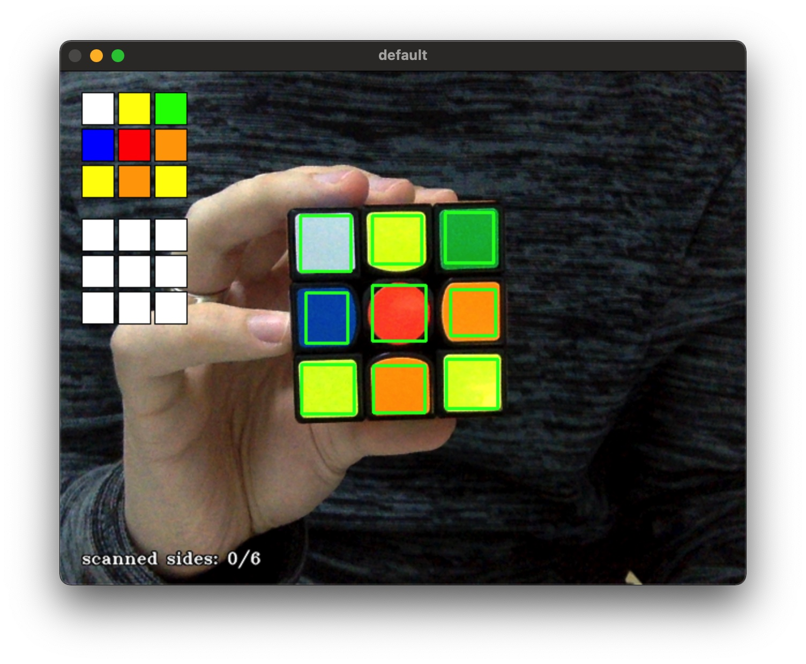
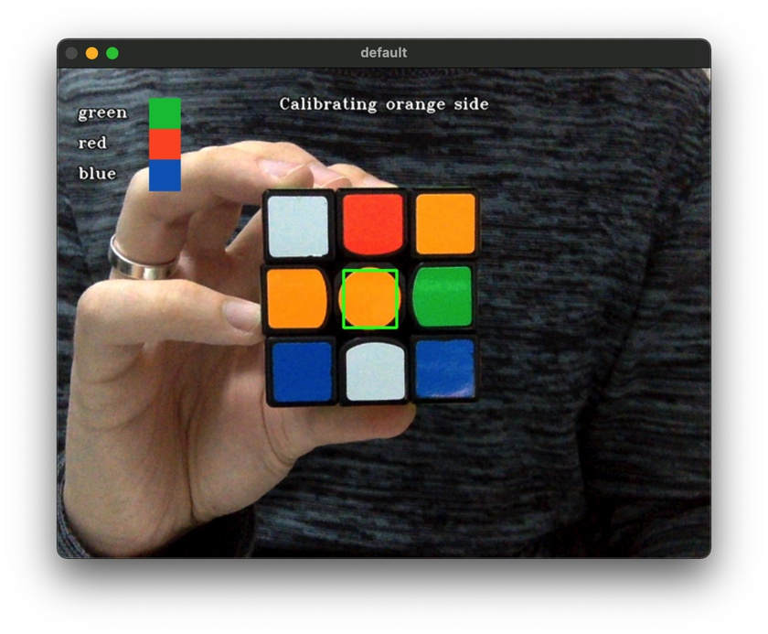
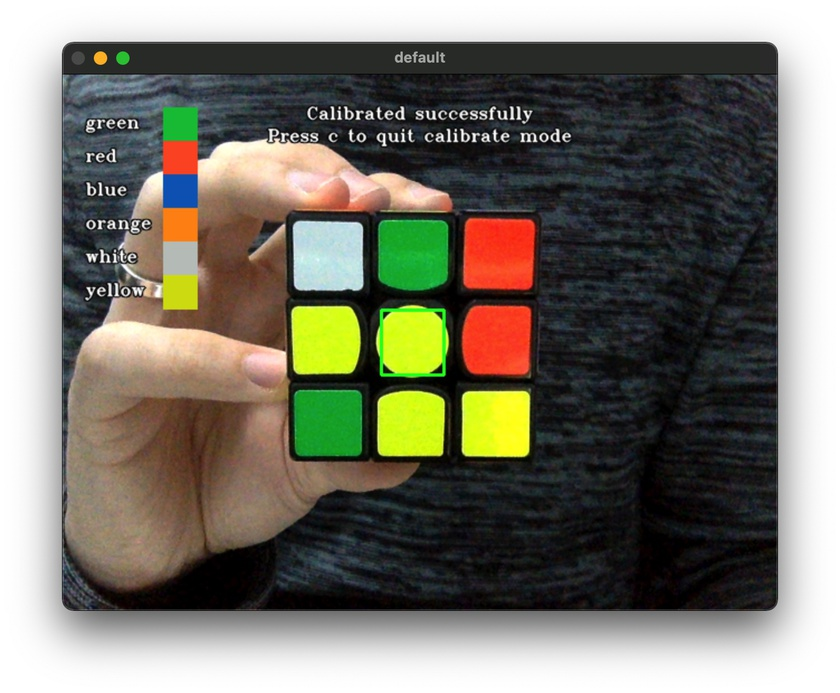

# Qbr

Qbr, pronounced as Cuber, is a webcam-based 3x3x3 rubik's cube solver written in
Python 3 and OpenCV.

- :rainbow: Accurate color detection
- :mag: Accurate 3x3x3 rubik's cube detection
- :capital_abcd: Multilingual

### Solve mode



### Calibrate mode

Isn't the default color detection working out for you? Use the **calibrate
mode** to let Qbr be familiar with your cube's color scheme. If your room has
proper lighting then this will give you a 99.9% guarantee that your colors will
be detected properly.

Simply follow the on-screen instructions and you're ready to go.




# Table of Contents

- [Qbr](#qbr)
    + [Solve mode](#solve-mode)
    + [Calibrate mode](#calibrate-mode)
- [Table of Contents](#table-of-contents)
- [Introduction](#introduction)
- [Installation](#installation)
- [Usage](#usage)
    + [The first 9-sticker display (upper left corner)](#the-first-9-sticker-display-upper-left-corner)
    + [The second 9-sticker display (upper left corner)](#the-second-9-sticker-display-upper-left-corner)
    + [Amount of sides scanned (bottom left corner)](#amount-of-sides-scanned-bottom-left-corner)
    + [Interface language (top right corner)](#interface-language-top-right-corner)
    + [Full 2D cube state visualization (bottom right corner)](#full-2d-cube-state-visualization-bottom-right-corner)
    + [Calibrate mode](#calibrate-mode-1)
- [Getting the solution](#getting-the-solution)
  * [How to scan your cube properly?](#how-to-scan-your-cube-properly)
- [Keybindings](#keybindings)
- [Paramaters](#paramaters)
- [Example runs](#example-runs)
- [Inspirational sources](#inspirational-sources)
- [License](#license)

# Introduction

The idea to create this came personally to mind when I started solving rubik's
cubes. There were already so many professional programmers around the world who
created robots that solve a rubik's cube in an ETA of 5 seconds and since 2016
in 1 second ([link](https://www.youtube.com/watch?v=ixTddQQ2Hs4)).
That inspired me to create my own. I started using images only and eventually
switched to webcam.

# Installation

```
$ git clone --depth 1 https://github.com/kkoomen/qbr.git
$ cd qbr
$ python3 -m venv env
$ source ./env/bin/activate
$ pip3 install -r requirements.txt
```

# Usage

**Make sure you run `source ./env/bin/activate` every time you want to run the
program.**

Run Qbr:

```
$ ./src/qbr.py
```

This opens a webcam interface with the following things:

### The first 9-sticker display (upper left corner)

This is preview mode. This will update immediately and display how Qbr has
detected the colors.

### The second 9-sticker display (upper left corner)

This is the snapshot state. When pressing `SPACE` it will create a snapshot in
order to show you what state it has saved. You can press `SPACE` as many times
as you'd like if it has been detected wrong.

### Amount of sides scanned (bottom left corner)

The bottom left corner shows the amount of sides scanned. This is so you
know if you've scanned in all sides before pressing `ESC`.

### Interface language (top right corner)

In the top right corner you can see the current interface language. If you want
to change the interface language you can press `l` to cycle through them.
Continue to press `l` until you've found the right language.

Default language is set to English.

Available languages are:

- English
- Hungarian
- Deutsch
- French
- Dutch
- 简体中文

### Full 2D cube state visualization (bottom right corner)

This visualization represents the whole cube state that is being saved and can
be used to confirm whether the whole cube state has been scanned successfully.

### Calibrate mode

The default color scheme contains the most prominent colors for white, yellow, red,
orange, blue and green. If this can't detect your cube its colors properly then
you can use calibrate mode.

Press `c` to go into calibrate mode in order to let Qbr be familiar with your
cube's color scheme. Simply follow the on-screen instructions and you're ready
to go.

Note: Your calibrated settings are automatically saved after you've calibrated
your cube successfully. The next time you start Qbr it will automatically load
it.

Tip: If you've scanned wrong, simple go out of calibrate mode by pressing `c`
and go back into calibrate by pressing `c` again.

# Getting the solution

Qbr checks if you have filled in all 6 sides when pressing `ESC`. If so, it'll
calculate a solution if you've scanned it correctly.

You should now see a solution (or an error if you did it wrong).

## How to scan your cube properly?

There is a strict way of scanning in the cube. Qbr will detect the side
automatically, but the way you rotate the cube during the time you're scanning
it is crucial in order for Qbr to properly calculate a solution. Make sure to
follow the steps below properly:

- Start off with the `green` side facing the camera and `white` on top, `green`
  being away from you. Start by scanning in the `green` side at this point.
- After you've scanned in the `green` side, rotate the cube 90 or -90 degrees
  horizontally. It doesn't matter if you go clockwise or counter-clockwise.
  Continue to do this for the `green`, `blue`, `red` and `orange` sides until
  you are back at the `green` side.
- You should now be in the same position like you started, having `green` facing
  the camera and `white` on top. Rotate the cube forward 90 degrees, resulting
  in `green` at the bottom and `white` facing the camera. Start scanning in the
  `white` side.
- After you've scanned the `white` side, turn the cube back to how you started,
  having `green` in front again and `white` on top. Now rotate the cube
  backwards 90 degrees, resulting in `green` on top and `yellow` facing the
  camera. Now you can scan in the last `yellow` side.

If you've done the steps above correctly, you should have a solution from Qbr.

# Keybindings

- `SPACE` for saving the current state

- `ESC` quit

- `c` toggle calibrate mode

- `l` switch interface language

# Paramaters

You can use `-n` or `--normalize` to also output the solution in a "human-readable" format.

For example:

* `R` will be: `Turn the right side a quarter turn away from you.`
* `F2` will be: `Turn the front face 180 degrees.`

# Example runs

```
$ ./qbr.py
Starting position:
front: green
top: white

Moves: 20
Solution: U2 R D2 L2 F2 L U2 L F' U L U R2 B2 U' F2 D2 R2 D2 R2
```

```
$ ./qbr.py -n
Starting position:
front: green
top: white

Moves: 20
Solution: B2 U2 F' R U D' L' B' U L F U F2 R2 F2 D' F2 D R2 D2
1. Turn the back side 180 degrees.
2. Turn the top layer 180 degrees.
3. Turn the front side a quarter turn to the left.
4. Turn the right side a quarter turn away from you.
5. Turn the top layer a quarter turn to the left.
6. Turn the bottom layer a quarter turn to the left.
7. Turn the left side a quarter turn away from you.
8. Turn the back side a quarter turn to the right.
9. Turn the top layer a quarter turn to the left.
10. Turn the left side a quarter turn towards you.
11. Turn the front side a quarter turn to the right.
12. Turn the top layer a quarter turn to the left.
13. Turn the front side 180 degrees.
14. Turn the right side 180 degrees.
15. Turn the front side 180 degrees.
16. Turn the bottom layer a quarter turn to the left.
17. Turn the front side 180 degrees.
18. Turn the bottom layer a quarter turn to the right.
19. Turn the right side 180 degrees.
20. Turn the bottom layer 180 degrees.
```

# Inspirational sources

Special thanks to [HaginCodes](https://github.com/HaginCodes) for the main
inspiration on how to improve my color detection.

https://github.com/HaginCodes/3x3x3-Rubiks-Cube-Solver

http://programmablebrick.blogspot.com/2017/02/rubiks-cube-tracker-using-opencv.html

https://gist.github.com/flyboy74/2cc3097f784c8c236a1a85278f08cddd

https://github.com/dwalton76/rubiks-color-resolver

# License

Qbr is licensed under the MIT License.
