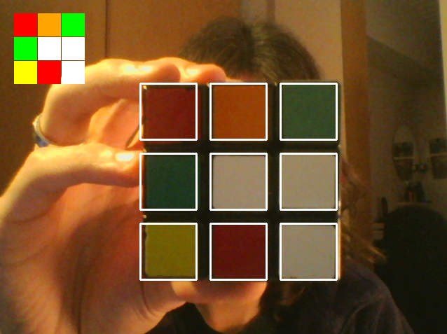

# qbr.
A rubik's cube solver written in python 3 using OpenCV using your webcam.

NOTE: qbr uses color detection and color detection is insanely hard to fix for
every possible situation, because certain light influences a color detector and the
color scheme on a rubik's cube.
The color detection in qbr is based on my color scheme which is a mid-bright scheme from
the [Gans365](http://thecubicle.us/images/gans56b3.jpg) and in a room with normal day light.

# Table of Contents
- [Introduction](#introduction)
- [Installation](#installation)
- [Usage](#usage)
    - [Paramaters](#paramaters)
- [License](#license)


# Introduction


The idea to create this came personally to mind when I started solving rubik's cubes.
I solve on average a 3x3x3 rubik's cube in 14 seconds when warmed up. My personal record
is 7.90 seconds, but there were already so many professional programmers around the world
who created robots that solve a rubik's cube in an ETA of 5 seconds and since 2016 in 1 second
([link](https://www.youtube.com/watch?v=ixTddQQ2Hs4)).
That inspired me to create my own. I started using images only and eventually switched to webcam.

One of the main things that killed me during developing this was color detection. It works for my
room, but I bet it doesn't work for you, or you must have the same lighting and color scheme as I do.

# Installation
Start off by cloning:
```
$ git clone https://github.com/kkoomen/qbr.git
$ cd qbr/qbr/
```

# Usage

Run qbr:

```
$ ./qbr.py
```

This opens a webcam interface where you see basically the above photo.
You have 4 things:

* The 9 center squares.

These are used for scanning in
your cube colors.

* The 9 stickers in the upper left corner.

These will update
immediately how the computer sees the colors.

* The seconds 9-sticker display below the one in the upper left corner.

When pressing `space` a 3rd cube template updates below the one in the upper left corner.
This is the state that is saved, so you know how qbr saved it.

* Amount of sides scanned

This is not shown in the above demo image, but in the bottom left corner is shown
the amount of sides scanned. This is so you know if you've scanned in all sides before
pressing `esc`.

### Keybindings:

`space` for saving the current view

`esc` for quit.

Qbr checks if you have filled in all 6 sides when pressing `esc`. If so, it'll
solve it if you've scanned it in correctly.

You should now see a solution (or an error if you did it wrong).

# Paramaters

You can use `-n` or `--normalize` to also output the solution in a "human-readable" format.

For example:

* `R` will be: `Turn the right side a quarter turn away from you.`
* `F2` will be: `Turn the front face 180 degrees.`

You can also specify a language by passing in `-l` or `--language`. Default language
is set to `en`. The only language other then english that is available is dutch which
is specified with `nl`.


#### Test runs I've done:

```
$ ./qbr.py
-- SOLUTION --
Starting position:
    front: green
    top: white

U2 R D2 L2 F2 L U2 L F' U L U R2 B2 U' F2 D2 R2 D2 R2 (20 moves)
```

```
$ ./qbr.py -n
-- SOLUTION --
Starting position:
    front: green
    top: white

B2 U2 F' R U D' L' B' U L F U F2 R2 F2 D' F2 D R2 D2 (20 moves)

1. Turn the back side 180 degrees.
2. Turn the top layer 180 degrees.
3. Turn the front side a quarter turn to the left.
4. Turn the right side a quarter turn away from you.
5. Turn the top layer a quarter turn to the left.
6. Turn the bottom layer a quarter turn to the left.
7. Turn the left side a quarter turn away from you.
8. Turn the back side a quarter turn to the right.
9. Turn the top layer a quarter turn to the left.
10. Turn the left side a quarter turn towards you.
11. Turn the front side a quarter turn to the right.
12. Turn the top layer a quarter turn to the left.
13. Turn the front side 180 degrees.
14. Turn the right side 180 degrees.
15. Turn the front side 180 degrees.
16. Turn the bottom layer a quarter turn to the left.
17. Turn the front side 180 degrees.
18. Turn the bottom layer a quarter turn to the right.
19. Turn the right side 180 degrees.
20. Turn the bottom layer 180 degrees.
```


# License

qbr is licensed under the MIT License.

Copyright (c) muts.
